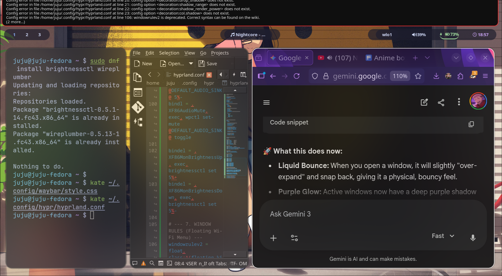

# 🟣 Liquid Glass Hyprland
A smooth, Oxygen OS 16 inspired Hyprland rice for Fedora.

### ✨ Features
- **iOS 16 Style Animations:** Smooth app shrinking and bouncy pop-ins.
- **Liquid Glass Aesthetic:** High-blur, translucent windows with a purple "Ripple" glow.
- **Optimized for AI/DS:** Fast shortcuts for VS Code and research workflows.

### 🚀 Installation
1. Clone the repo: 
   `git clone https://github.com/yogarajjuju/fedora-hyprland-rice.git`
2. Run the installer: 
   `./install.sh`
