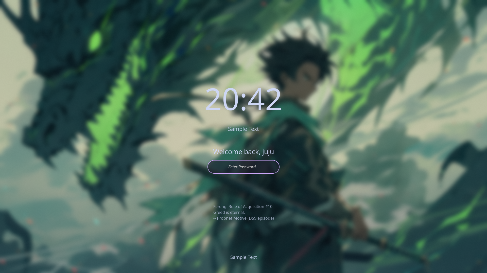
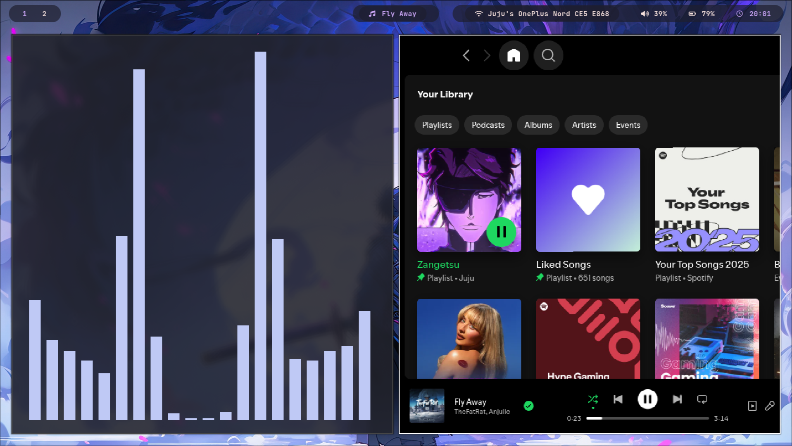
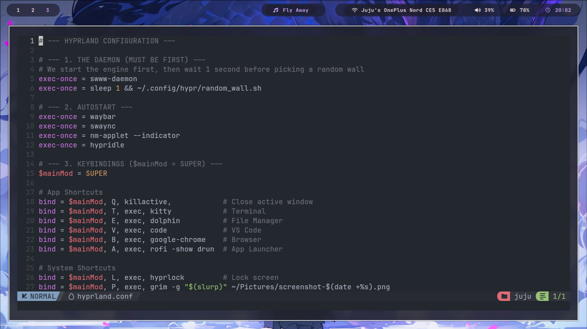
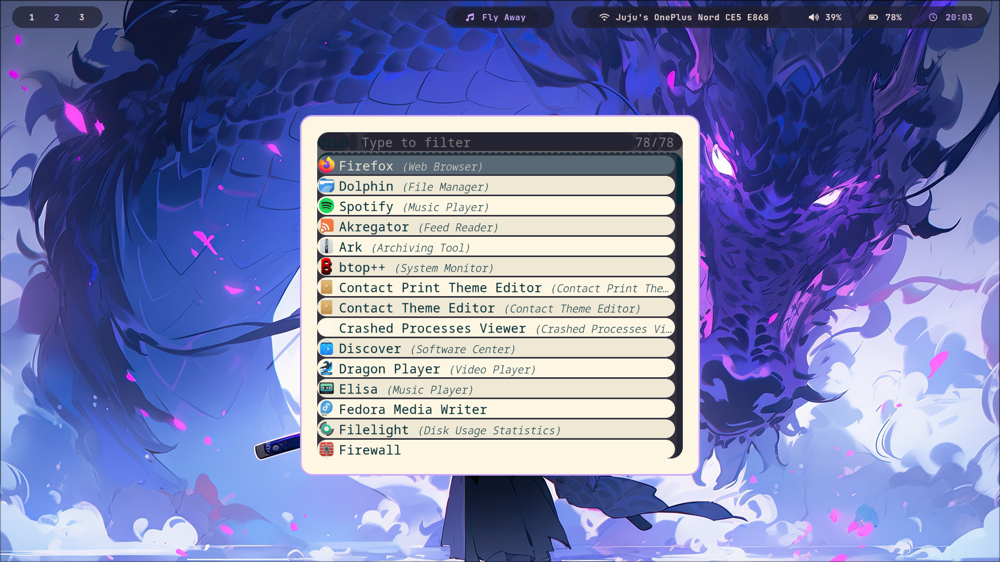
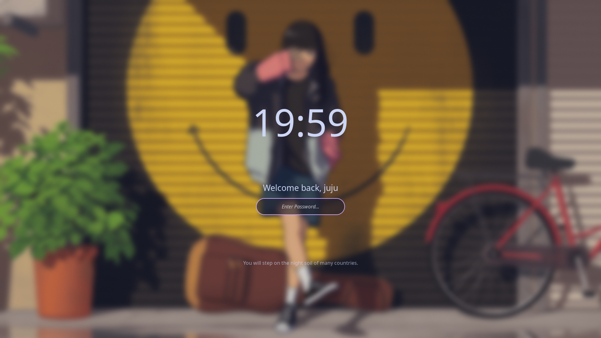

# 🌊 Hyra
A fluid, glass-inspired Hyprland setup for Fedora

Minimal. Fluid. Beautiful.

A smooth, **OxygenOS 16 inspired Hyprland setup for Fedora**, featuring a modern *liquid glass* aesthetic with blur effects, animations, and a fully customized desktop experience.

---


---

## ⚠️ Warning

This setup will **modify your system configuration**.

* Recommended for **fresh Fedora installations**
* Backup your existing configs before installing
* Use at your own risk

---

## 📋 Requirements

* Fedora 39 / 40
* Internet connection
* Git installed

> ⚠️ NVIDIA users may require additional drivers

---

## 👤 Who is this for?

* Users who want a **ready-to-use Hyprland setup**
* Beginners who don’t want to configure everything manually
* Linux users who enjoy **aesthetic desktop environments**

---

## ✨ Features

* 🎞️ **OxygenOS 16 Style Animations**
  Smooth app shrinking and bouncy pop-in transitions

* 💜 **Liquid Glass Aesthetic**
  High blur, transparency, and purple glow effects

* 🔒 **Auto Locking**
  Integrated `hypridle` with 3-minute inactivity lock

* 🎵 **Media Integration**
  Waybar + Spotify/MPRIS + Cava visualizer

* ⚡ **Preconfigured Workflow**
  Useful keybindings and productivity setup out of the box

---

## ⌨️ Keybindings

| Keys              | Action                       |
| ----------------- | ---------------------------- |
| `SUPER + T`       | Open Terminal (Kitty)        |
| `SUPER + B`       | Open Browser (Google Chrome) |
| `SUPER + V`       | Open VS Code                 |
| `SUPER + E`       | Open File Manager (Dolphin)  |
| `SUPER + A`       | Open App Launcher (Rofi)     |
| `SUPER + Q`       | Close Active Window          |
| `SUPER + L`       | Lock Screen                  |
| `SUPER + P`       | Take Screenshot              |
| `SUPER + ALT + W` | Cycle Random Wallpaper       |

---

## 📦 What gets installed?

* Hyprland (Wayland compositor)
* Waybar (status bar)
* Kitty (terminal)
* Rofi (application launcher)
* Cava (audio visualizer)
* Fonts, themes, and configuration files

---

## 🚀 Installation

Run the following commands:

```bash
git clone https://github.com/yogarajjuju/Hydra.git
cd fedora-hyprland-rice
chmod +x install.sh
./install.sh
```

---

## 📸 Full Setup Gallery

### 🔒 Security & Lockscreen


*Custom lockscreen with blur and "juju" welcome message.*

---

### 🎵 Media & Visualizer


*Waybar integration with Spotify/MPRIS and Cava visualizer.*

---

### 💻 Development Environment


*NeoVim and terminal with liquid glass transparency.*

---

### 🖥️ Workspace & Window Management


*Smooth workspace transitions and floating window rules.*

---

### 🕒 System & Alternate Styles





---

## ♻️ Reset / Uninstall

Currently, there is no automated uninstall script.

To reset manually:

* Remove configs from `~/.config/`
* Remove installed packages if needed

---

## 🤝 Contributing

Contributions, suggestions, and improvements are welcome!

* Fork the repository
* Create a new branch
* Submit a pull request

---

## ⭐ Support

If you like this project, consider giving it a **star ⭐ on GitHub** — it helps a lot!

---

## 🧑‍💻 Author

Created by **Yogaraj Juju**
