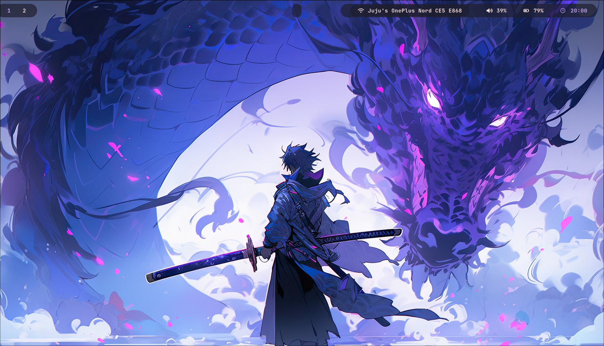
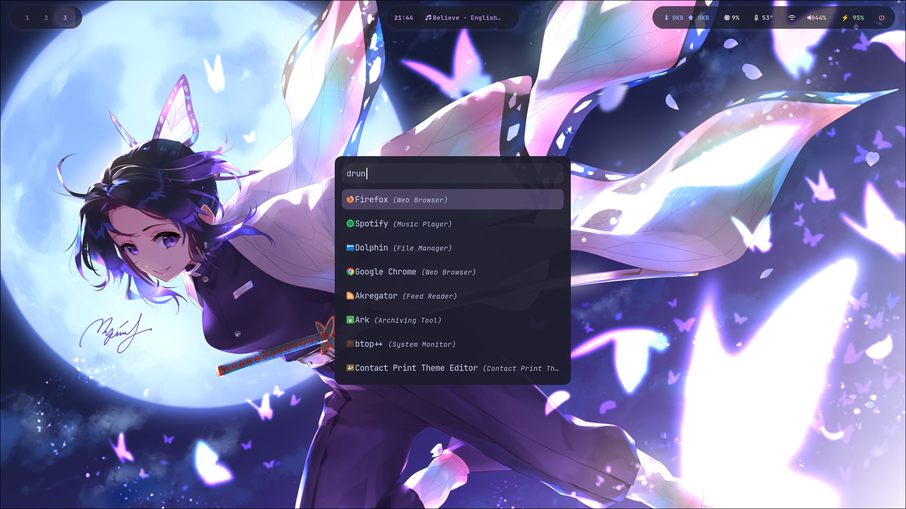
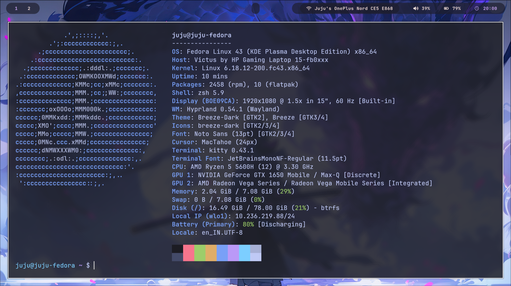
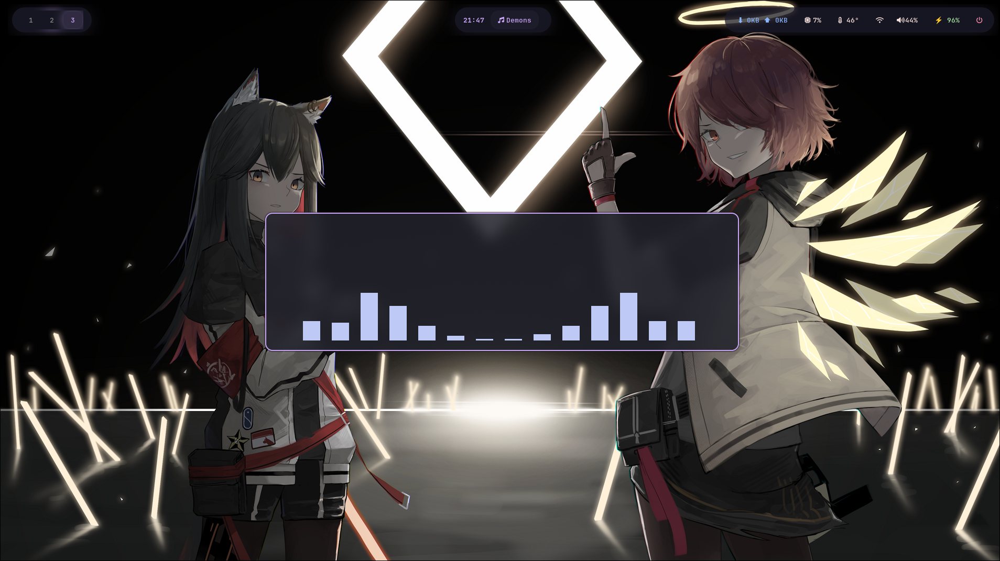
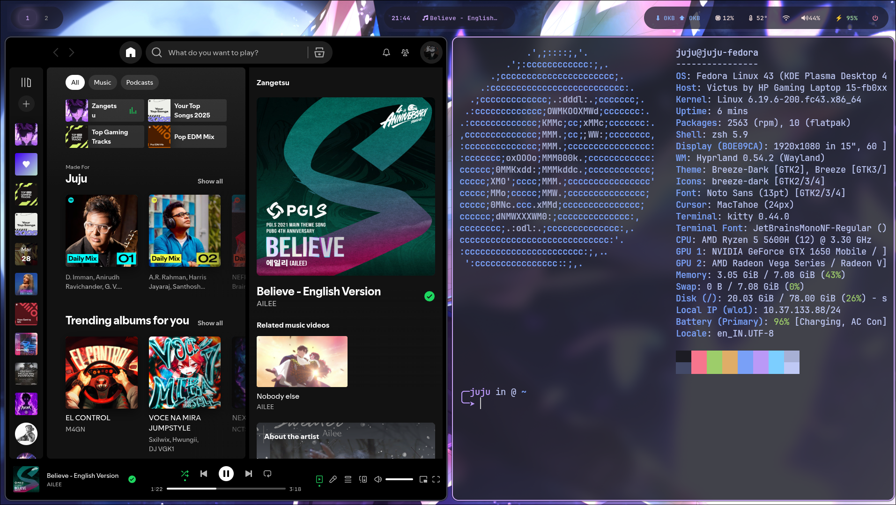
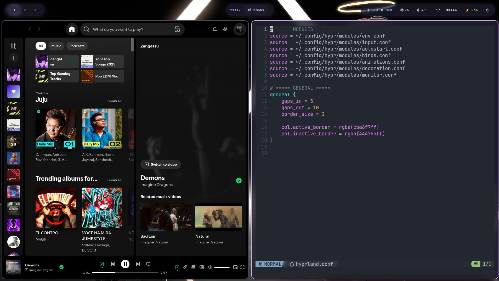
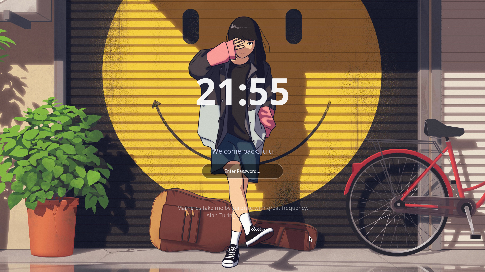
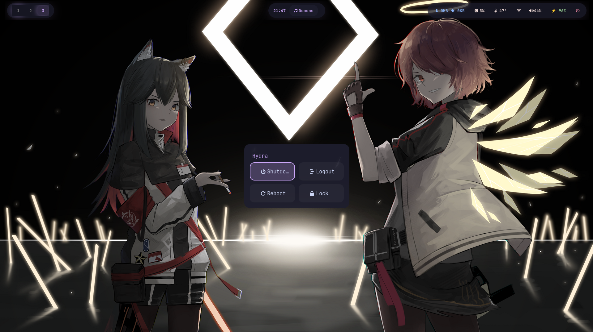

<div align="center">



<br/>

# 🌊 Hyra

### A fluid, glass-inspired Hyprland setup · Fedora & Arch

[](LICENSE)
[](https://hyprland.org)
[](https://fedoraproject.org)
[](https://archlinux.org)

*Minimal. Fluid. Beautiful.*

</div>

---

A smooth, **OxygenOS 16-inspired Hyprland rice for Fedora & Arch**, featuring a modern *liquid glass* aesthetic with blur effects, custom animations, media integration, and a fully automated install/update/uninstall workflow. Version **v2.0-elite**.

---

## 📸 Gallery

<details>
<summary><b>🖥️ Desktop & Workspace</b></summary>
<br/>


*Rofi app launcher over the main desktop*


*Smooth workspace transitions and floating windows*

</details>

<details>
<summary><b>🎵 Media & Visualizer</b></summary>
<br/>


*Cava audio visualizer floating on the desktop*


*Spotify running alongside Fastfetch system info*


*Spotify and Neovim side-by-side with liquid glass transparency*

</details>

<details>
<summary><b>🔒 Lock & Power</b></summary>
<br/>


*Custom hyprlock screen with blur and welcome message*


*Rofi-based power menu with Shutdown, Reboot, Lock, and Logout*

</details>

---

## ✨ Features

- 🎞️ **OxygenOS 16 Animations** — Switchable between smooth & bouncy styles on the fly  
- 💜 **Liquid Glass Aesthetic** — High blur, transparency, and purple glow throughout  
- 🔒 **Auto Lock** — `hypridle` locks after 3 minutes of inactivity via `hyprlock`  
- 🎵 **Media Integration** — Waybar + Spotify/MPRIS with a floating Cava visualizer  
- 📦 **Dual Distro Support** — Auto-detects Fedora (dnf) or Arch (pacman)  
- 🔄 **Update Script** — Pull latest configs with one command, no manual work  
- 🗑️ **Uninstall Script** — Clean removal with backup preservation  
- 💾 **Auto Backup & Rollback** — Installer backs up your existing configs before touching anything  
- 🌐 **WiFi TUI** — Quick network manager via `nmtui` in a floating terminal  
- 🎨 **Random Wallpaper Cycle** — Hotkey to shuffle wallpapers on the fly  
- 📋 **In-built Cheatsheet** — View all keybinds from Rofi with `SUPER + /`

---

## ⌨️ Keybindings

### Apps & System

| Keys | Action |
|------|--------|
| `SUPER + T` | Terminal (Kitty) |
| `SUPER + B` | Browser (Google Chrome) |
| `SUPER + V` | VS Code |
| `SUPER + E` | File Manager (Dolphin) |
| `SUPER + A` | App Launcher (Rofi) |
| `SUPER + Q` | Close Active Window |
| `SUPER + L` | Lock Screen |
| `SUPER + W` | WiFi Manager (nmtui) |
| `SUPER + P` | Screenshot (region) |
| `Print` | Screenshot (fullscreen) |
| `SUPER + /` | View Keybind Cheatsheet |
| `SUPER + C` | Toggle Floating Cava |
| `SUPER + ALT + W` | Random Wallpaper |

### Window Management

| Keys | Action |
|------|--------|
| `SUPER + F` | Fullscreen |
| `SUPER + SHIFT + SPACE` | Toggle Floating |
| `SUPER + Arrow Keys` | Move Focus |
| `SUPER + SHIFT + Arrows` | Move Window |
| `SUPER + CTRL + Arrows` | Swap Windows |
| `SUPER + ALT + Arrows` | Resize Window |
| `SUPER + Tab` | Cycle Layout |
| `SUPER + S` | Toggle Split |
| `ALT + LMB` | Drag Window |
| `ALT + RMB` | Resize Window |

### Animations

| Keys | Action |
|------|--------|
| `SUPER + SHIFT + F1` | Smooth Animations |
| `SUPER + SHIFT + F2` | Bounce Animations |

### Workspaces

| Keys | Action |
|------|--------|
| `SUPER + 1–5` | Switch Workspace |
| `SUPER + SHIFT + 1–5` | Move Window to Workspace |

### Media & Volume

| Keys | Action |
|------|--------|
| `XF86AudioRaiseVolume` | Volume Up |
| `XF86AudioLowerVolume` | Volume Down |
| `XF86AudioMute` | Mute Toggle |
| `XF86MonBrightnessUp/Down` | Brightness Control |
| `ALT + CTRL_R` | Reload Waybar |

---

## 📦 What Gets Installed

- **Hyprland** — Wayland compositor
- **Waybar** — Status bar with MPRIS media widget
- **Kitty** — Terminal emulator
- **Rofi** — Application launcher & power menu
- **Cava** — Audio visualizer
- **swww** — Wallpaper daemon
- **hyprlock / hypridle** — Lock & idle daemon
- **grim + slurp** — Screenshot tools
- **brightnessctl** — Brightness control
- **wireplumber** — Audio session manager
- **NetworkManager-tui / networkmanager** — WiFi TUI

---

## 📋 Requirements

- Fedora 39/40/41 **or** Arch Linux
- Internet connection
- `git` installed

> ⚠️ **NVIDIA users** may need additional driver configuration.  
> ⚠️ Recommended on a **fresh install** or after backing up your configs.

---

## 🚀 Installation

```bash
git clone https://github.com/yogarajjuju/Hydra.git
cd Hydra
chmod +x install.sh
./install.sh
```

The installer will:
1. Auto-detect your distro (Fedora or Arch)
2. Let you choose **Full Install** (packages + configs) or **Configs Only**
3. Automatically **backup** your existing `~/.config/hypr`, `waybar`, and `scripts`
4. Install everything with a progress indicator and spinner
5. **Auto-rollback** if anything goes wrong

Backups are saved to `~/.config/hydra_backup_<timestamp>`.

---

## 🔄 Update

Pull the latest version and reapply configs in one step:

```bash
./update.sh
```

This will `git pull`, backup your current configs, apply the new ones, and reload Hyprland automatically.

---

## 🗑️ Uninstall

```bash
./uninstall.sh
```

Removes `~/.config/hypr`, `waybar`, and `scripts`. Your backups at `~/.config/hydra_backup_*` are preserved.

---

## ⚠️ Warning

This setup **modifies system configuration files**. Always backup before installing. The installer does this automatically, but you can also do it manually.

---

## 🤝 Contributing

Contributions, suggestions, and improvements are welcome!

1. Fork the repository
2. Create a new branch
3. Submit a pull request

---

## ⭐ Support

If you like this project, consider giving it a **star ⭐** — it helps a lot!

---

<div align="center">

Made with 💜 by **[Yogaraj Juju](https://github.com/yogarajjuju)**

</div>
